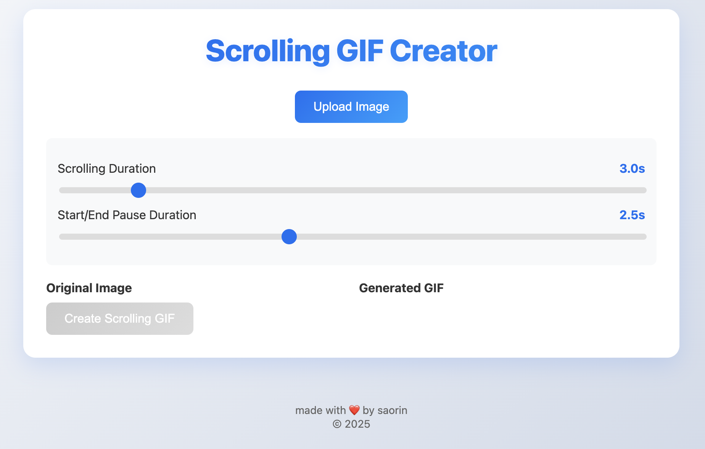

# Scrolling GIF Creator

A simple web-based tool that converts long screenshots or images into smoothly scrolling GIFs. Perfect for showcasing website content, long documents, or social media posts in an engaging animated format. Currently hosted at [gifscrolling.joseluissaorin.com](https://gifscrolling.joseluissaorin.com).



## Features

- 📸 **Simple Upload**: Drag and drop or select any image file
- ⚙️ **Customizable Settings**: Adjust scrolling and pause durations
- 🎯 **Optimized Output**: Creates smooth scrolling animations
- 💾 **Instant Download**: Automatically downloads the generated GIF
- 📱 **Responsive Design**: Works on both desktop and mobile devices

## Getting Started

1. Clone the repository:
   ```bash
   git clone https://github.com/joseluissaorin/ScrollingGIF.git
   cd ScrollingGIF
   ```

2. Open `static-gif-creator.html` in your web browser

   No additional setup required! The tool runs entirely in your browser.

## Technology Stack

- **GIF Generation**: [gif.js](https://jnordberg.github.io/gif.js/)
- **UI**: Vanilla JavaScript and CSS
- **Animation**: HTML5 Canvas

## License

This project is licensed under the MIT License - see the [LICENSE](LICENSE) file for details.

## Author

Created by [José Luis Saorín Ferrer](https://github.com/joseluissaorin)

## Acknowledgments

- Thanks to [gif.js](https://jnordberg.github.io/gif.js/) for the GIF encoding library 